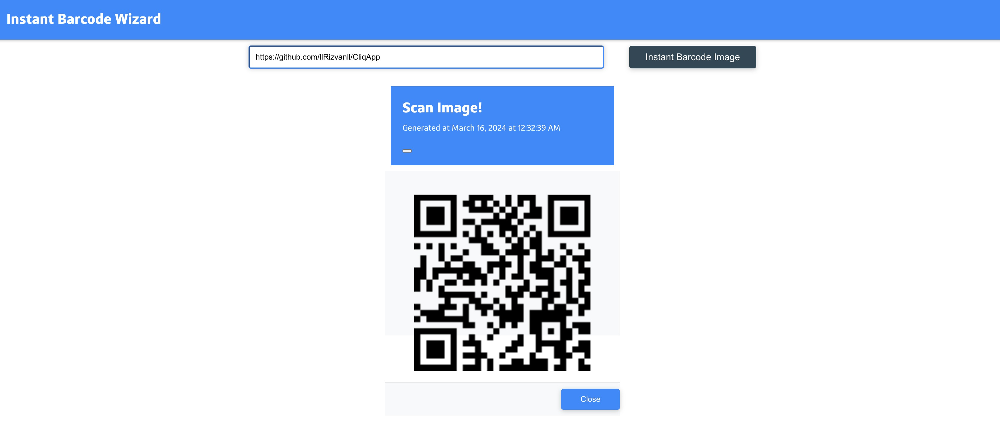
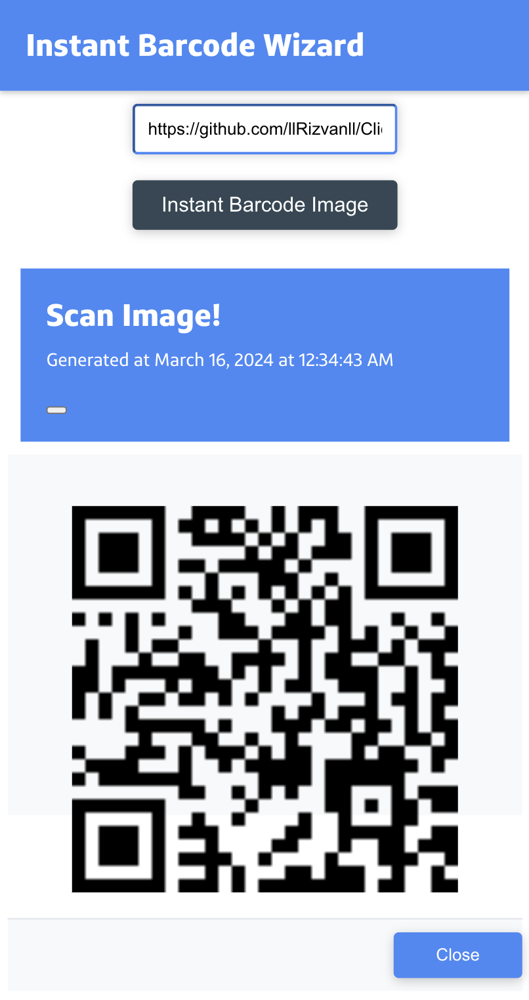
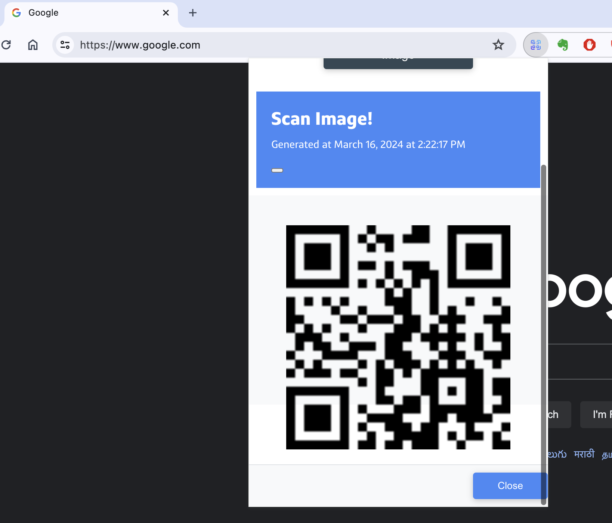
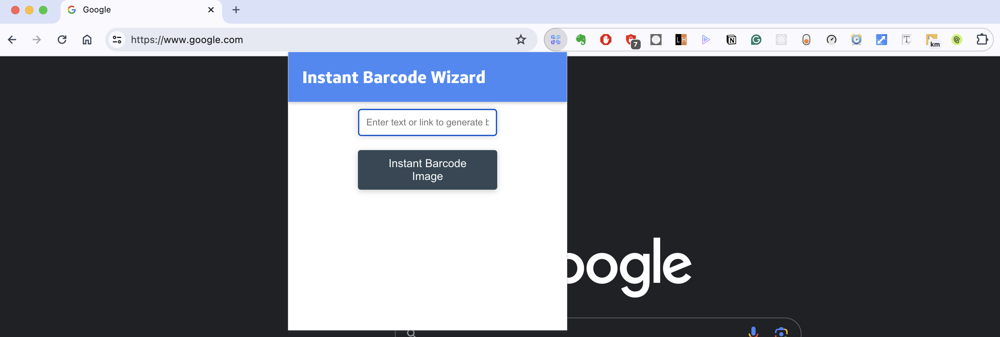

# Instant Barcode By Link

Generate instant barcode images from any link, text, or description with a single click. This project is available as both a web app and a Chrome extension.

## Features

- Generate barcodes instantly
- Easy to use interface
- Available as a web app and a Chrome extension

## Web App

The web app is deployed on [Vercel](https://barcode-by-link.vercel.app/). Here's what it looks like:

And here's the mobile view:

## Chrome Extension

We also have a Chrome extension. Here's what it looks like:

And here's another view of the Chrome extension:

## Contribute

If you like this project and want to help me create more projects like this, consider buying me a coffee:

## Running the App

### Web App

To run the web app locally, follow these steps:

1. Clone the repository: `git clone https://github.com/yourusername/yourrepository.git`
2. Navigate into the directory: `cd yourrepository`
3. Install the dependencies: `npm install`
4. Start the app: `npm start`

The app will be available at `http://localhost:3000`.

### Chrome Extension

To load the Chrome extension locally, follow these steps:

1. Build the project: `npm run build`
2. Go to `chrome://extensions/` in your Chrome browser.
3. Enable Developer mode (toggle the switch in the top right corner).
4. Click on "Load unpacked" and select the `build` directory of your project.

The extension will be added to your browser toolbar.
